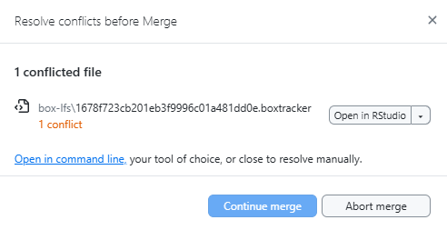

<!-- README.md is generated from README.Rmd. Please edit that file -->

# Box Large File Storage (`blfs`)

<!-- badges: start -->

<!-- badges: end -->

`blfs` is an R package that makes it easier to work with **large files**
in GitHub projects.

By default:

- **GitHub** doesn’t let you upload files larger than **100 MB**.

- **Git LFS** (Large File Storage) raises the limit to **2 GB**, but it
  still has problems:

  - Free accounts have a storage cap.

  - Even if you delete a file, it stays hidden in the project’s history
    and still takes up space.

  - Completely removing these files often means recreating the whole
    repository and losing commit history.

For the **Wildfire and Water Security (WWS)** project, we have unlimited
storage on [Box](https://www.box.com/home).

`blfs` lets us keep the big files in Box while still using GitHub for
everything else — so we get the best of both worlds.

## How it works

- Instead of storing the big file directly in GitHub, `blfs` creates a
  **small pointer file** that says *where the real file lives in Box*.

- These pointer files have the extension `.boxtracker` and are stored in
  GitHub.

- The actual large files live in Box, inside a special `box-lfs` folder.

## Installation

Install the package from [GitHub](https://github.com/):

``` r
# install.packages("remotes")
remotes::install_github("wildfire-water-security/WWS-box-lfs", subdir="blfs")
```

## Box Drive

Box LFS works best if you also install [Box
Drive](https://www.box.com/resources/downloads) from Box.

- Lets R move files to and from Box

- Tracked files will be automatically synced on Box

**Without** Box Drive, you will be prompted to **manually** upload and
download files from Box.

## Basic Usage

### Creating a new Git repository with Box LFS

If you already have a folder you want to turn into a GitHub repository
(repo) that uses Box for large files, start with:

``` r
  new_repo_blfs(dir = new_dir, size = 0.0001, box_dir = box_tmp) 
#> ℹ the following files will no longer be tracked by git:
#> example-files/example-shp.*
#> example-files/large-file1.txt
#> example-files/large-file2.txt
#> ✔ Large files are now backed up in Box.
```

- `dir` is the folder you want to set up.

- `size` is the minimum size (in MB) that counts as a “large” file.
  Default is **10 MB**, but here we use a small number so our example
  files are included.

**With this, your tracked large files will be uploaded to the specified
Box folder**

### Cloning a GitHub repository using Box LFS

When you clone a GitHub repo that uses Box LFS, you get the code and
.boxtracker pointer files — but not the big files themselves. To
download those files and put them in the right place, run:

``` r
clone_repo_blfs(dir=clone_dir)
#> ✔ Large files have been fetched from Box and put in repository.
```

- `dir` is the folder with the cloned repository.

**With this, your cloned repo will have the correct large files in the
right locations within your local project directory.**

### Pushing a GitHub repository using Box LFS

**Before** you push changes to a repository that uses Box LFS, you need
to:

1.  Check if any **tracked files** have been updated.

2.  See if there are **new large files** that should be tracked.

You can do both with:

``` r
push_repo_blfs(dir=clone_dir, size=0.0001)
#> ✔ Large files have been synced with Box.
```

- `dir` is your local repository folder.
- `size` is the minimum file size (in MB) that counts as a “large” file.
  Default is **10 MB**.
- Here we use a smaller number so our example files are included.

**Any new or updated file will be updated on Box and the `.boxtracker`
will be updated so others know there’s a new copy of the file.**

### Pulling a GitHub repository using Box LFS

**After** you pull changes from a GitHub repository that uses Box LFS,
you need to:

1.  Check if any **tracked files** have been updated on Box.

2.  Check if any local tracked files should be pushed before downloading
    the updated files.

You can do both with:

``` r
pull_repo_blfs(dir=clone_dir)
#> ✔ Large files have been fetched from Box and put in repository.
#> ✔ Large files have been synced with Box.
```

- `dir` is your local repository folder.

**Any new or updated files stored on Box will be copied from Box into
your local project directory**

## Best Practices

In any Git project, it’s good practice to:

- **Pull changes** from GitHub *before* you start work each day.

- **Push your changes** to GitHub when you’re done for the day or after
  making a big change.

With **Box LFS**, this is even more important.

- Box LFS doesn’t track every little change inside a large file; it only
  stores the **new version** each time you update it.

- If you don’t keep up with changes other people make, you can run into
  something called a **merge conflict**.

A merge conflict happens when:

- You commit changes to a tracked file locally (but don’t push them to
  GitHub yet).

- Meanwhile, someone else changes that *same* file in their copy and
  pushes it to GitHub.

- When you finally try to push your changes, GitHub says:

  > “These two versions of the file don’t match — I can’t decide which
  > one is correct.”

In Box LFS projects, this usually means the `.boxtracker` files for that
large file are different between your commit and theirs.

The safest way to avoid this? **Pull first, push often.**

## What to do if you get a merge conflict

If you try to pull or push changes and Git shows something like:

<figure>

<figcaption aria-hidden="true">Example of merge conflict</figcaption>
</figure>

Don’t worry, it just means your version of the file and the version on
GitHub are different, and Git wants you to choose which one to keep.

### Step 1: Decide which version to keep

Open the conflicted file in R or a text editor to look at the two
versions. Open up the file in Box to see the most recent version.

Ask yourself:

- Did **you** upload the latest version of the large file to Box? → Keep
  your pointer file.

- Did **someone else** upload a newer version to Box? → Keep their
  pointer file.

  > **Tip:** If both versions of the large file are important, rename
  > one before uploading to Box so the project can keep both without
  > overwriting. You can then update `path-hash.csv` and its
  > `.boxtracker` file to match.

### Step 2: Edit the file to remove conflict markers

Conflict markers look like this:

    #> <<<<<<< HEAD
    #> *your version*
    #> =======
    #> *their version*
    #> >>>>>>> branch-name

- Delete the lines with `<<<<<<< HEAD`, `=======`, and
  `>>>>>>> branch-name`.

- Keep only the version you decided in Step 1.
