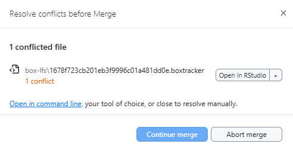

<!-- README.md is generated from README.Rmd. Please edit that file -->

# Box Large File Storage (`blfs`)

<!-- badges: start -->

<!-- badges: end -->

`blfs` is an R package that makes it easier to work with **very large
files** in GitHub projects.

By default:

- **GitHub** doesn’t let you upload files larger than **100 MB**.

- **Git LFS** (Large File Storage) raises the limit to **2 GB**, but it
  still has problems:

  - Free accounts have a storage cap.

  - Even if you delete a file, it stays hidden in the project’s history
    and still takes up space.

  - Completely removing these files often means recreating the whole
    repository and losing commit history.

For the **Wildfire and Water Security (WWS)** project, we have unlimited
storage on [Box](https://www.box.com/home).

`blfs` lets us keep the big files in Box while still using GitHub for
everything else — so we get the best of both worlds.

## How it works

- Instead of storing the big file directly in GitHub, `blfs` creates a
  **small pointer file** that says *where the real file lives in Box*.

- These pointer files have the extension `.boxtracker` and are stored in
  GitHub.

- The actual large files live in Box, inside a special `box-lfs` folder.

## Installation

Install the package from [GitHub](https://github.com/):

``` r
# install.packages("remotes")
remotes::install_github("wildfire-water-security/WWS-box-lfs", subdir="blfs")
library(blfs)
library(git2r)
```

## Best Practices

In any Git project, it’s good practice to:

- **Pull changes** from GitHub *before* you start work each day.

- **Push your changes** to GitHub when you’re done for the day or after
  making a big change.

With **Box LFS**, this is even more important.

- Box LFS doesn’t track every little change inside a large file; it only
  stores the **new version** each time you update it.

- If you don’t keep up with changes other people make, you can run into
  something called a **merge conflict**.

A merge conflict happens when:

- You commit changes to a tracked file locally (but don’t push them to
  GitHub yet).

- Meanwhile, someone else changes that *same* file in their copy and
  pushes it to GitHub.

- When you finally try to push your changes, GitHub says:

  > “These two versions of the file don’t match — I can’t decide which
  > one is correct.”

In Box LFS projects, this usually means the `.boxtracker` files for that
large file are different between your commit and theirs.

The safest way to avoid this? **Pull first, push often.**

------------------------------------------------------------------------

## Creating a new Git repository with Box LFS

If you already have a folder you want to turn into a GitHub repository
(repo) that uses Box for large files, start with:

``` r
  new_repo_blfs(dir = new_dir, size = 0.0001) 
```

- `dir` is the folder you want to set up.

- `size` is the minimum size (in MB) that counts as a “large” file.
  Default is **10 MB**, but here we use a small number so our example
  files are included.

------------------------------------------------------------------------

### File structure before running `new_repo_blfs()`

    #> ~/new_dir
    #> └── example-files
    #>     ├── large-file1.txt
    #>     └── large-file2.txt

------------------------------------------------------------------------

### File structure after running `new_repo_blfs()`

    #> ~/new_dir
    #> ├── box-lfs
    #> │   ├── 1678f723cb201eb3f9996c01a481dd0e.boxtracker
    #> │   ├── 4fa7622e82d068a0a994eafb564e4f5d.boxtracker
    #> │   ├── path-hash.csv
    #> │   └── upload
    #> │       ├── 1678f723cb201eb3f9996c01a481dd0e.txt
    #> │       └── 4fa7622e82d068a0a994eafb564e4f5d.txt
    #> ├── example-files
    #> │   ├── large-file1.txt
    #> │   └── large-file2.txt
    #> └── README.md

**What’s new?**

- There’s a new folder, `box-lfs` which contains:

  - `.boxtracker` pointer files (these replace the large files in
    GitHub).

  - An `upload` folder with the real large files, renamed to **hashes**
    (unique ID codes) so files with the same name don’t overwrite each
    other.

  - A `path-hash.csv` file that links the hash back to the original file
    name and location.

- There’s a new file, `README.md`, the landing page for the repository
  which alerts users that Box LFS is being used.

------------------------------------------------------------------------

### What you’ll see when you run `new_repo_blfs()`

1.  **Warning about large files**

        #> Warning in new_repo_blfs(dir = new_dir, size = 2e-04): the following files will no longer be tracked by git:
        #>     example-files/large-file1.txt
        #>     example-files/large-file2.txt

    This is **expected** — these files are now tracked by Box, not
    GitHub.

2.  **Message telling you to upload files to Box**

        #> Please upload files from 'example-repo-abc123/box-lfs/upload' to Box here:
        #> 'Wildfire_Water_Security/02_Nodes/your node/Projects/example-repo-abc123/box-lfs'

    **Do this next:**

    - Go to the correct folder in Box for your project.

    - Inside that project’s folder, create a `box-lfs` folder if it
      doesn’t exist.

    - Upload everything from your local `upload` folder into Box.

3.  **Prompt asking for the Box link**

        #> what is the box link to the folder where the data is now backed up?

    Paste the Box share link here — the package stores it so it knows
    where to get the files later.

------------------------------------------------------------------------

## Cloning a GitHub repository using Box LFS

When you clone a GitHub repo that uses Box LFS, you get the code and
.boxtracker pointer files — but not the big files themselves. To
download those files and put them in the right place, run:

``` r
clone_repo_blfs(dir=clone_dir, download=dwd)
```

- `dir` is the folder with the cloned repository.
- `download` is the folder with the downloaded `.zip` file.

------------------------------------------------------------------------

### Check if a repo uses Box LFS

You can check by running:

``` r
check_blfs(clone_dir)
#> [1] TRUE
```

If it says `TRUE`, the repo uses Box LFS.

------------------------------------------------------------------------

### File structure before running `clone_repo_blfs()`

    #> ~/clone_dir
    #> └── box-lfs
    #>     ├── 1678f723cb201eb3f9996c01a481dd0e.boxtracker
    #>     ├── 4fa7622e82d068a0a994eafb564e4f5d.boxtracker
    #>     └── path-hash.csv

------------------------------------------------------------------------

### File structure after running `clone_repo_blfs()`

    #> ~/clone_dir
    #> ├── box-lfs
    #> │   ├── 1678f723cb201eb3f9996c01a481dd0e.boxtracker
    #> │   ├── 4fa7622e82d068a0a994eafb564e4f5d.boxtracker
    #> │   └── path-hash.csv
    #> └── example-files
    #>     ├── large-file1.txt
    #>     └── large-file2.txt

------------------------------------------------------------------------

### What you’ll see when you run `clone_repo_blfs()`

1.  **Message telling you where to get the files from Box**

        #> Please download files from Box here:
        #> 'Wildfire_Water_Security/02_Nodes/your node/Projects/example-repo-abc123/box-lfs'
        #> they will be automatically moved to the correct locations from your downloads folder

    **Do this next:**

    - Go to the provided Box link or Box path.

    - Download the folder (Box will give it to you as a .zip file).

2.  **Prompt to continue**

        #> hit any key once files have been downloaded to continue setting up the repo

    Press Enter when your download is ready.

3.  **Prompt to confirm the zip file location**

        #> Zip file for downloaded data appears to be: ~/Downloads/box-lfs-zip.zip
        #> Press enter to use this file or provide a different file path.

    If this is correct, press Enter. If not, type the correct file path
    and press Enter.

**With this, your cloned repo will have the correct large files in the
right locations.**

------------------------------------------------------------------------

## Pushing a GitHub repository using Box LFS

**Before** you push changes to a repository that uses Box LFS, you need
to:

1.  Check if any **tracked files** have been updated.

2.  See if there are **new large files** that should be tracked.

You can do both with:

``` r
push_repo_blfs(dir=clone_dir, size=0.0001)
```

- `dir` is your local repository folder.
- `size` is the minimum file size (in MB) that counts as a “large” file.
  Default is **10 MB**.
- Here we use a smaller number so our example files are included.

### What you’ll see when you run `push_repo_blfs()`:

1.  **Message telling you to upload files to Box**

    You’ll only see this message if there are **new or updated files**
    that need to be uploaded to Box. If there are no changes, the
    function will finish without printing anything.

        #> Please upload files from 'example-repo-abc123/box-lfs/upload' to Box here:
        #> 'Wildfire_Water_Security/02_Nodes/your node/Projects/example-repo-abc123/box-lfs'

    **Do this next:**

    - Go to the correct folder in Box for your project.
    - Inside that project’s folder, go to the `box-lfs` folder.
    - Upload everything from your **local** `upload` folder into Box.

------------------------------------------------------------------------

## Pulling a GitHub repository using Box LFS

**After** you pull changes from a GitHub repository that uses Box LFS,
you need to:

1.  Check if any **tracked files** have been updated on Box.

2.  Check if any local tracked files should be pushed before downloading
    the updated files.

You can do both with:

``` r
pull_repo_blfs(dir=clone_dir, download=dwd)
```

- `dir` is your local repository folder.
- `download` is the folder with the downloaded `.zip` file.

### What you’ll see when you run `pull_repo_blfs()`:

1.  **Message telling you to upload files to Box**

    You’ll only see this message if there are **new or updated files**
    that need to be **uploaded** to Box. We run this check to make sure
    that any local changes to the tracked files are

        #> Please upload files from 'example-repo-abc123/box-lfs/upload' to Box here:
        #> 'Wildfire_Water_Security/02_Nodes/your node/Projects/example-repo-abc123/box-lfs'

    **Do this next:**

    - Go to the correct folder in Box for your project.

    - Inside that project’s folder, go to the `box-lfs` folder.

    - Upload everything from your **local** `upload` folder into Box.

2.  **Message telling you where to get the files from Box**

    You’ll only see this message if there are **new or updated files**
    that need to be **downloaded** from Box.

        #> Please download files from Box here:
        #> 'Wildfire_Water_Security/02_Nodes/your node/Projects/example-repo-abc123/box-lfs'
        #> they will be automatically moved to the correct locations from your downloads folder

    **Do this next:**

    - Go to the provided Box link or Box path.

    - Download the folder (Box will give it to you as a .zip file).

------------------------------------------------------------------------

## What to do if you get a merge conflict

If you try to pull or push changes and Git shows something like:



Don’t worry, it just means your version of the file and the version on
GitHub are different, and Git wants you to choose which one to keep.

### Step 1: Decide which version to keep

Open the conflicted file in R or a text editor to look at the two
versions. Open up the file in Box to see the most recent version.

Ask yourself:

- Did **you** upload the latest version of the large file to Box? → Keep
  your pointer file.

- Did **someone else** upload a newer version to Box? → Keep their
  pointer file.

  > **Tip:** If both versions of the large file are important, rename
  > one before uploading to Box so the project can keep both without
  > overwriting. You can then update `path-hash.csv` and its
  > `.boxtracker` file to match.

### Step 2: Edit the file to remove conflict markers

Conflict markers look like this:

    #> <<<<<<< HEAD
    #> *your version*
    #> =======
    #> *their version*
    #> >>>>>>> branch-name

- Delete the lines with `<<<<<<< HEAD`, `=======`, and
  `>>>>>>> branch-name`.

- Keep only the version you decided in Step 1.
